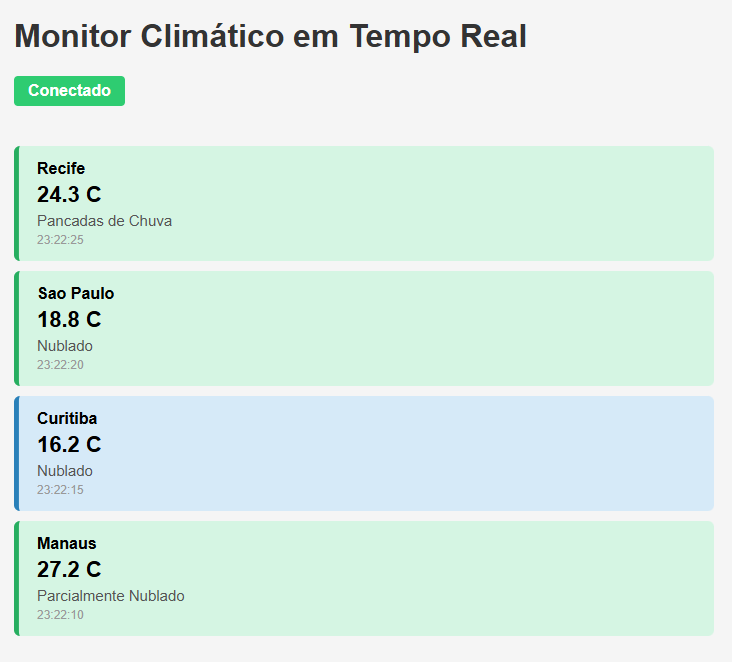

# Monitor Climático — WebSocket + STOMP

Sistema de monitoramento de temperatura em tempo real. O servidor **empurra** dados para o cliente a cada 5 segundos via WebSocket, sem necessidade de requisições repetitivas (polling).

---

## Tecnologias

- Java 17 + Spring Boot 3
- WebSocket com STOMP e SockJS
- Open-Meteo API (gratuita, sem cadastro)
- HTML + JavaScript puro

---

## Como rodar

```bash
# 1. Clone o repositório
https://github.com/guilhex/clima-websockets
cd clima-websocket

# 2. Suba o servidor
./mvnw spring-boot:run

# 3. Acesse no navegador
http://localhost:8080
```

---

## Fluxo de mensagens

```
Servidor (@Scheduled a cada 5s)
  → sorteia 1 das 10 cidades
  → consulta temperatura na Open-Meteo API
  → envia JSON para /topic/clima via STOMP

Cliente (browser)
  → conectado via SockJS em /ws-clima
  → inscrito em /topic/clima
  → recebe o JSON e exibe o card com a cor correta
```

**Estrutura do JSON enviado pelo servidor:**
```json
{
  "cidade": "Manaus",
  "temperatura": 31.2,
  "descricao": "Ceu Limpo",
  "horario": "20:15:43"
}
```

**Cor dos cards por temperatura:**
- 🔵 Azul → frio (≤ 18 °C)
- 🟢 Verde → ameno (19–27 °C)
- 🔴 Vermelho → quente (≥ 28 °C)

---

## Print do sistema

> **
